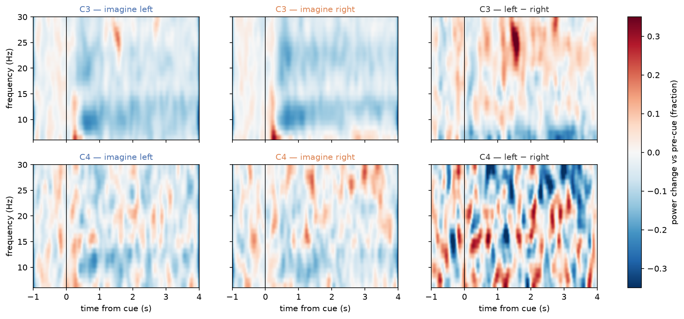
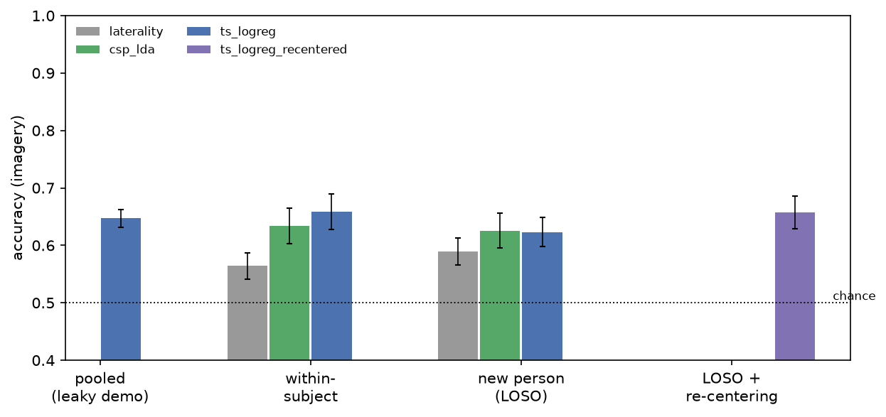
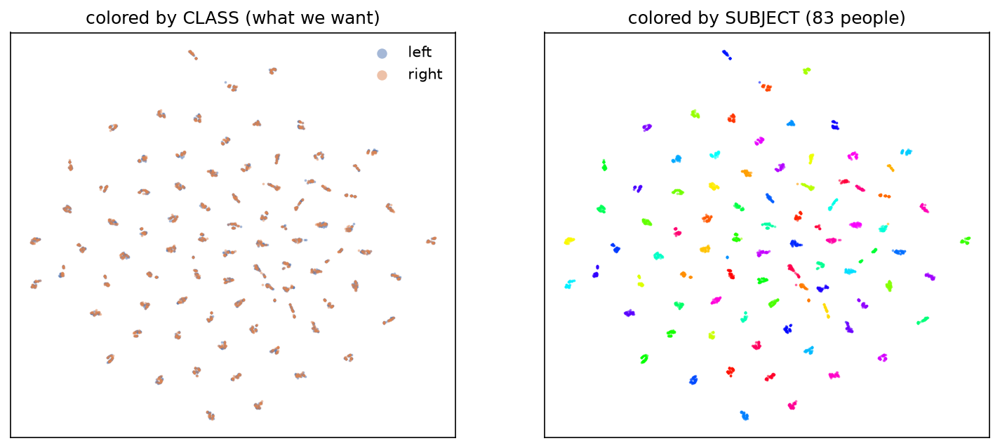

# Left vs Right Fist Motor-Imagery Decoding — EEGMMIDB

Decoding *imagined* left- vs right-fist movement from 64-channel EEG (PhysioNet
EEG Motor Movement/Imagery Dataset, 109 subjects), built around one question a skeptical
reader would ask first: **what else could explain this number?**

**Defended result:** a tangent-space classifier with unsupervised per-subject re-centering
reaches **61.7% ± 3.2** (chance 50%) on a **20-subject held-out test set** evaluated exactly
once — subjects no analysis touched before that run. The same model scores 65.9%
within-subject and 62.3% cross-subject without adaptation. The gap between the first number
you'd naively report (64.7%, leaky pooled split) and the defended one, and *why* each rung
differs, is most of this README.

## Quickstart

```bash
uv sync                                   # exact pinned env (uv.lock; requirements.txt also provided)
uv run python scripts/00_check_data.py    # verify the dataset is visible
```

Without uv: `python3.11 -m venv .venv && source .venv/bin/activate && pip install -r requirements.txt`.

**Getting the data:** download EEGMMIDB v1.0.0 from
[PhysioNet](https://physionet.org/content/eegmmidb/1.0.0/) (or the AWS mirror:
`aws s3 sync --no-sign-request s3://physionet-open/eegmmidb/1.0.0/ ./files/`), then either
symlink it to `data/` (PhysioNet layout `data/Sxxx/SxxxRyy.edf`) or set `MI_DATA_DIR=/path/to/files`.

**Predict on a raw EDF (one line):**

```bash
uv run python predict.py data/S042/S042R04.edf
```

Prints one line per cued trial — onset, predicted `left`/`right`, confidence. Useful flags:
`--score` (compare against the file's own annotations), `--recenter` (unsupervised
adaptation on this file's trials), `--json out.json`. Accepts any L/R-fist run
(R03/04/07/08/11/12) from any subject; resamples non-160 Hz files; refuses baseline runs;
warns on fists/feet runs where T1/T2 mean different classes.

## Pipeline walkthrough (raw signal → result)

Every processing stage ships a figure; the fully captioned gallery is
[`results/figures/GALLERY.md`](results/figures/GALLERY.md). The short version:

| Stage | What happens | Why |
|---|---|---|
| S0 | 64 ch @160 Hz raw EEG + cue annotations arrive | see what models start from |
| S1 | programmatic label audit (498 files) | T1/T2 semantics verified, not assumed; 6 documented-defect subjects re-verified and excluded |
| S2 | 8–30 Hz band-pass (model view) | mu/beta band where motor ERD lives; kills drift, blinks, 60 Hz by construction |
| S3 | cue-locked epochs, 0.5–3.5 s window | skip cue transient, stay inside the ~4.1 s trial |
| S4 | repair + reject | electrode faults interpolated (a channel that alone rejects >50% of a file); bursts >500 µV dropped (2.7%) |
| S5 | trial → 64×64 covariance → tangent space | the model's actual input representation |
| S6 | CSP patterns, readout saliency, per-subject spread | what was learned, and for whom it works |
| S7 | the evaluation ladder + transfer | the number depends on the exam |


*The physiological signal itself: imagining RIGHT suppresses the mu/beta rhythm at C3
(left motor cortex) — the contralateral organization every model here exploits.*

## Results

**Development set (83 subjects, imagery, mean over subjects):**

| Exam | Floor (C3/C4) | CSP+LDA | Tangent+LR | + re-centering |
|---|---|---|---|---|
| Pooled random split (leaky — demo only) | — | — | 64.7% | — |
| Within-subject (run-grouped 3-fold) | 56.4% | 63.4% | 65.9% | — |
| New person (LOSO) | 59.0% | 62.6% | 62.3% | **65.7%** |

**Held-out test set (20 subjects, single shot, pre-committed headline):**

| Arm | Pooled accuracy (884 trials) |
|---|---|
| **Tangent+LR + re-centering (headline)** | **61.7% ± 3.2** |
| Tangent+LR, no adaptation (secondary) | 55.7% ± 3.3 |
| CSP+LDA (secondary) | 54.9% ± 3.3 |



**What a skeptical reader should take from this:**

1. **The person dominates the signal.** From identical features and an identical run-grouped
   split, subject *identity* decodes at **100.0%** (chance 1.2%) while the imagined hand
   decodes at 68.9% (chance 50%). The t-SNE below shows why: 83 tight per-person islands,
   classes mixed within each. Any evaluation that lets a person straddle the train/test split
   is partly a person-recognizer.

   

2. **Most of the cross-subject penalty is a removable offset.** Unsupervised re-centering —
   re-estimating only the tangent-space reference from the new subject's unlabeled trials,
   classifier frozen — recovers most of the within-vs-LOSO gap on the dev set (62.3 → 65.7
   vs 65.9) and degrades most gracefully on the held-out test set (61.7% vs 55.7% unadapted).
   Fixed cross-subject models are fragile to *which* people you test on; adaptation absorbs
   much of that.
3. **Executed and imagined movement share a representation.** Train on real movements, test
   on imagery (or reverse): 65.8% both directions — indistinguishable from the within-imagery
   reference (65.9%). Also evidence the decoder is not reading muscle artifacts: if it were,
   executed-trained models would collapse on imagery.
4. **Learned *and* memorized, precisely located.** Training accuracy 94.0% vs 62.3% LOSO —
   the model overfits to *who is being recorded*, not to which hand: the learning curve still
   rises with more training subjects (saturating near 40) and the label-shuffle null is clean
   (47.3%, p95 61.8%).
5. **The range, not the best case.** Per-subject accuracies span chance to ~95%
   (sd ≈ 13pp on every rung). With ~45 trials per subject, a single subject's score needs to
   exceed ~62% for individual significance — population claims are safe, per-person rankings
   are not. One subject (S018) decodes significantly *below* chance within-subject (31.1%) —
   an open oddity consistent with pattern inversion between runs.

## How the evaluation avoids measuring itself

- **Subject-level splits everywhere it matters**; the pooled-leaky rung exists only to show
  what a naive split reports (and even that inflates the honest same-protocol number by 2.4pp).
- **Run-grouped folds within subject** (3 runs → 3 folds): no same-run temporal leakage.
- **A code-enforced holdout**: the loader raises on the 20 test subjects unless explicitly
  unlocked by the one final script; the headline arm was **declared in `DECISIONS.md` before
  the unlock** (dev-LOSO winner), so no model selection happened on test results.
- **Fixed a-priori knobs** (epoch window, rejection threshold) with sensitivity checks —
  rejection on/off moves the result by 0.2pp, reported as such.
- **Everything fit-able lives inside CV folds** (sklearn pipelines); per-trial Ledoit-Wolf
  covariances are stateless and safely precomputed.
- Full decision/attempt trail: [`DECISIONS.md`](DECISIONS.md).

## One design decision

> [NIVI — write this in your voice. Material: chose band-pass + two-level objective cleaning
> (repair electrode faults / reject bursts) over ICA; the real alternative was ICA with
> component labeling; include the miscalibration story — first threshold used the wrong
> statistic, rejected 75%, diagnosed from amplitude distributions, fixed from artifact
> statistics only — and the punchline that the sensitivity check showed rejection barely
> mattered after the band-pass did the real work.]

## Weakest point

> [NIVI — your voice. Material: ~45 trials/subject → ±15pp per-subject CIs; the defended
> claim is population-level; semantic label errors (S038/S089-class) are invisible to
> structural audits; re-centering is transductive-in-the-unlabeled-sense (uses the test
> file's own unlabeled trials, as a real calibration recording would).]

## Something the prompts didn't ask about

The label audit itself surfaced things: task-segment durations are quantized to exactly two
values (4.088 s / 4.100 s — a BCI2000 timing artifact uniform across the pool); S038 carries
a documented defect that **no structural check reproduces** (its runs look perfectly clean —
the defect must be semantic, which is precisely why it stayed excluded); and one dev subject
decodes reliably *below* chance within-subject, which shouldn't happen unless class-conditional
patterns invert between runs.

## With more time and compute

Subject-conditional models (per-subject calibration beyond re-centering — Procrustes/transport
alignment), a compact CNN (EEGNet) with the same ladder to test whether nonlinearity buys
anything past ~40 training subjects, ICA as an actual comparison arm, resting-state mu power
(runs R01/R02) as a predictor of per-subject decodability, and the fists/feet paradigm for a
4-class problem.

## AI use

> [NIVI — your voice, per the required disclosure: which tools, for what; then one specific
> choice explained entirely in your own words.]

## Layout & reproduction

```
src/mi_decoding/   config data labels preprocess features models evaluate analysis viz
scripts/           00_check_data → 01_audit_labels → 02_preprocess_cache → 03_train_eval → 04_final_holdout → 05_figures
predict.py         grader-facing CLI          models/  trained artifact
results/           tables + figures/GALLERY.md DECISIONS.md  engineering log
```

Run scripts in numbered order to reproduce everything (03 is the long one, ~2 h CPU;
04 re-runs the held-out evaluation — note ours counts as the single shot).

## References

- Schalk G. et al., *BCI2000: a general-purpose brain-computer interface system.* IEEE TBME 51(6), 2004.
- Goldberger A.L. et al., *PhysioBank, PhysioToolkit, and PhysioNet.* Circulation 101(23), 2000.
- Gramfort A. et al., *MEG and EEG data analysis with MNE-Python.* Front. Neurosci., 2013.
- Barachant A. et al., *Multiclass brain-computer interface classification by Riemannian geometry.* IEEE TBME, 2012 (pyRiemann).
