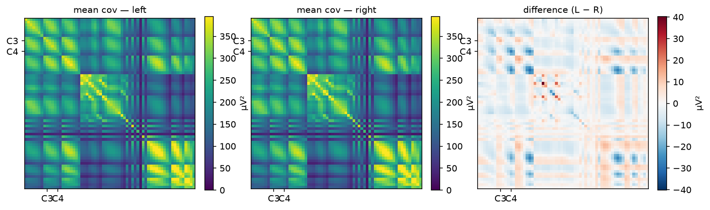
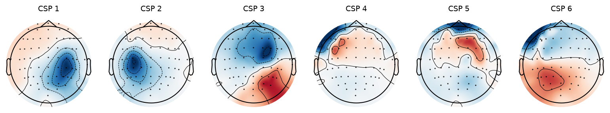
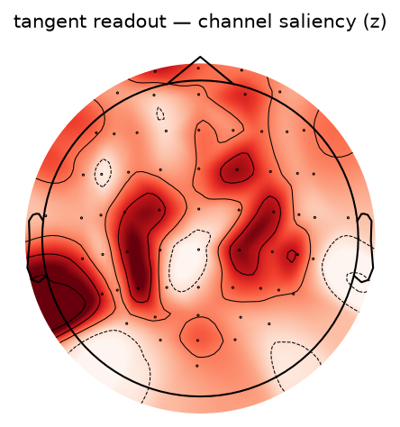
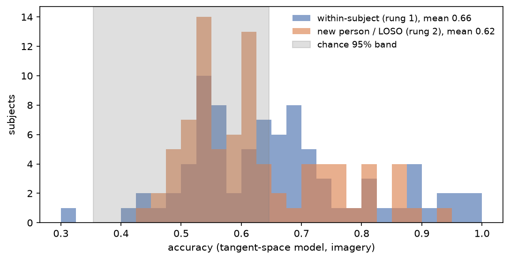
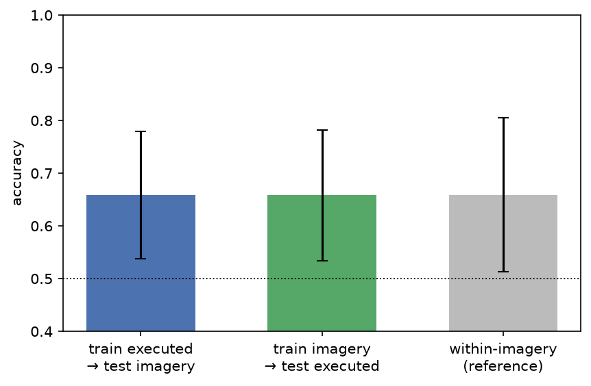

# Pipeline gallery — walkthrough for the demo video

Regenerate: `uv run python scripts/05_figures.py`
### s0_raw_trace

**S0 — What arrives.** Twenty seconds of raw EEG from 9 of the 64 channels. Shaded spans are the cue annotations embedded in the EDF (blue = left-fist cue, orange = right-fist cue; unshaded gaps = rest). Note the scale: tens of µV, dominated by slow drift and broadband noise — no class difference is visible to the eye. Everything downstream exists to change that.

### s0_montage

**S0 — Where the signal should live.** Sensor layout over the scalp (nose up). C3 sits over left motor cortex and C4 over right motor cortex. Because motor control is contralateral, imagining the LEFT hand should suppress rhythms at C4 (orange ↔ left class) and the RIGHT hand at C3 (blue ↔ right class) — the spatial hypothesis every later figure gets checked against.

### s1_label_audit

**S1 — Label audit.** Left: every L/R-fist run carries ~15 cued trials with a ~8/7 class split (the imbalance is why balanced accuracy is reported too). Middle: task segments take exactly two durations, 4.088 or 4.100 s — a BCI2000 timing artifact, uniform across the pool. Right: per-subject class totals lie on an anti-diagonal (left + right ≈ 90 fixed trials), with the split ranging only 42–48 — mild, bounded imbalance and no class-skewed subjects.

### s2_filtering

**S2 — Filtering.** Left: the average power spectrum. Raw EEG (grey) shows the 1/f drift ramp at low frequencies and the 60 Hz mains line. The 8–30 Hz band-pass (black) keeps exactly the mu (8–13 Hz) and beta (13–30 Hz) bands where motor imagery suppresses rhythmic power (ERD), and removes drift, blink energy (<4 Hz), most EMG, and line noise by construction. Right: the same C3 segment before/after — what remains is the band-limited oscillation whose per-trial power the models consume.

### s3_epoching

**S3 — Epoching (S050, imagery runs).** Left: the continuous band-passed signal is cut into cue-locked windows; the analysis window [0.5, 3.5] s skips the cue-onset transient and stays inside the ~4.1 s trial. Middle/right: every extracted trial at C3 stacked as an image (one row = one trial). Single trials are dominated by trial-to-trial variability — no visible class difference at one electrode — which is exactly why the models pool spatial structure across all 64 channels.

### s4_rejection

**S4 — Cleaning.** Two levels, both label-free. (1) Repair: a channel that alone would reject most of a run is an electrode fault, not a trial problem — it gets interpolated from neighbors (9 run files needed this). (2) Reject: epochs where any remaining channel exceeds 500 µV peak-to-peak on the analysis window (left panel; right: per-subject drop rates, overall 2.72%). The threshold was revised once from artifact statistics after the initial 100 µV — calibrated to single-channel scale — rejected 75% of epochs; decoding results never influenced it. A with/without-rejection sensitivity check accompanies the model results.

### s5_erd

**S5 — The physiological signal itself.** Grand-average (83 dev subjects, imagery runs) time-frequency power at the two motor electrodes, as fractional change from the pre-cue baseline. Blue = the rhythm quieting (ERD). The diagnostic is the diagonal: imagining LEFT suppresses power at C4 (right hemisphere) more than C3, and imagining RIGHT does the opposite — the contralateral organization the classifiers exploit. This is what 'the signal' looks like before any model touches it. Third column: the left−right difference. At C3 the contrast is clear and sustained — more mu/beta suppression when imagining RIGHT, the contralateral prediction. At C4 the grand-average contrast is weak: a real hemispheric asymmetry (typical of right-hand-dominant populations; the dataset ships no handedness metadata), and one more reason per-subject variability is the story.

### s5_covariances

**S5 — What the main model actually sees.** Each trial is summarized as a 64×64 covariance matrix: diagonal = per-channel band power, off-diagonal = channel co-fluctuation. Left/middle: class means (dev pool, imagery). Right: their difference — the class information lives in a structured, low-amplitude pattern around the sensorimotor rows (C3/C4 marked). The tangent-space model reads exactly this object; CSP is a supervised 6-dimensional compression of it.

### s5_embedding

**S5 — Who dominates the representation.** One point = one trial: the same t-SNE projection of the tangent-space vectors, colored two ways. Left: by imagined hand — classes are thoroughly mixed at the global scale. Right: by person — trials cluster into tight per-subject islands. The representation encodes WHO is being recorded far more strongly than WHAT they imagined; this is the geometric reason pooled-leaky evaluation inflates and cross-subject decoding is hard.

### s6_csp_patterns

**S6 — What the baseline model learned.** Forward-model patterns of the six CSP filters (fit on the dev pool, imagery). Patterns concentrating over the central sensorimotor region (around C3/C4) mean the filters read motor-cortex rhythms; patterns over eyes or temporal muscle would expose artifact decoding. This is the visual check that the decoder's evidence is physiological.

### s6_readout_saliency

**S6 — Where the main model puts its weight.** Heuristic saliency: total absolute logistic-regression weight on all covariance entries involving each channel, z-scored (aggregating a 2,080-dim readout to channel level after tangent-space whitening is indicative only — the CSP patterns are the rigorous spatial evidence). Central concentration argues for motor rhythms over artifacts.

### s6_per_subject

**S6 — The person, not just the task.** Each count is one subject's accuracy for the SAME model under two exams: trained on that person's other runs (blue) vs trained only on other people (orange). The wide spread is real inter-person variability ('BCI illiteracy': some subjects sit inside the gray chance band under both exams); the blue→orange shift is the personalization gap. With ~45 trials per subject, individual bars carry ±≈15% binomial uncertainty — population statements are safe, per-subject rankings are not.

### s7_ladder

**S7 — The number depends on the exam.** Identical models, increasingly honest evaluations. The pooled random split (leftmost) mixes each person's trials across train/test — its score is inflated by subject identity and is shown only as the cautionary 'first number you see'. Within-subject is the personalized-BCI setting; LOSO is a brand-new person; re-centering adapts only the embedding reference using the new person's unlabeled data. Error bars: binomial 95% CIs.

### s7_transfer

**S7 — Do the two tasks share a representation?** Within each subject, a model trained only on REAL movements and tested on IMAGINED ones (and the reverse), against the within-imagery reference. Above-chance transfer means executed and imagined movement modulate overlapping spatial patterns — evidence the decoder reads motor physiology rather than condition-specific quirks. Bars: mean ± SD across subjects.

