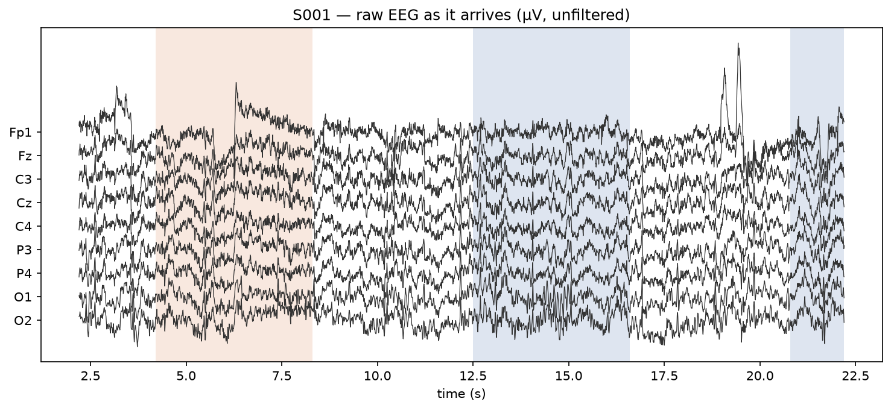
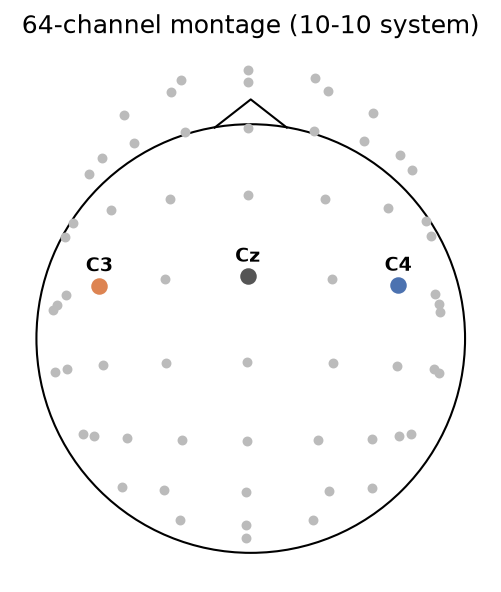
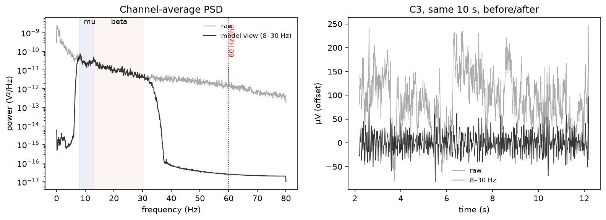
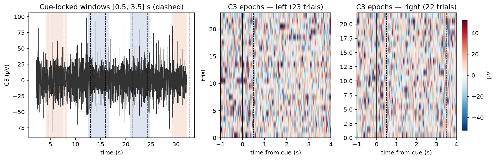
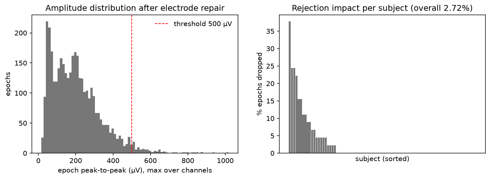
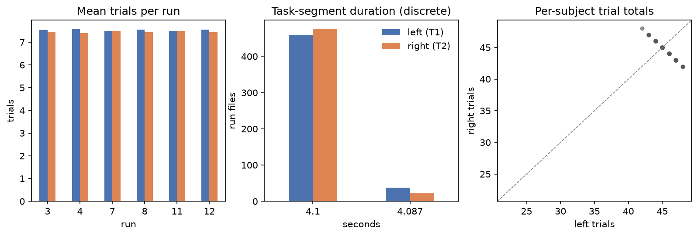

# Pipeline gallery — walkthrough for the demo video

Regenerate: `uv run python scripts/05_figures.py`

**S1 — Label audit.** Left: every L/R-fist run carries ~15 cued trials, split ~8/7 between classes (the imbalance is why balanced accuracy is reported too). Middle: task segments last ~4.1–4.2 s, consistent across the dev pool. Right: each subject contributes ~45 trials per class over 6 runs (3 imagined + 3 executed); points hug the diagonal, so no subject is class-skewed.

**S0 — What arrives.** Ten seconds of raw EEG from 9 of the 64 channels. Shaded spans are the cue annotations embedded in the EDF (blue = left-fist cue, orange = right-fist cue; unshaded gaps = rest). Note the scale: tens of µV, dominated by slow drift and broadband noise — no class difference is visible to the eye. Everything downstream exists to change that.

**S0 — Where the signal should live.** Sensor layout over the scalp (nose up). C3 sits over left motor cortex and C4 over right motor cortex. Because motor control is contralateral, imagining the LEFT hand should suppress rhythms at C4 (orange ↔ left class) and the RIGHT hand at C3 (blue ↔ right class) — the spatial hypothesis every later figure gets checked against.

**S2 — Filtering.** Left: the average power spectrum. Raw EEG (grey) shows the 1/f drift ramp at low frequencies and the 60 Hz mains line. The 8–30 Hz band-pass (black) keeps exactly the mu (8–13 Hz) and beta (13–30 Hz) bands where motor imagery suppresses rhythmic power (ERD), and removes drift, blink energy (<4 Hz), most EMG, and line noise by construction. Right: the same C3 segment before/after — what remains is the band-limited oscillation whose per-trial power the models consume.

**S3 — Epoching (S001, imagery runs).** Left: the continuous band-passed signal is cut into cue-locked windows; the analysis window [0.5, 3.5] s skips the cue-onset transient and stays inside the ~4.1 s trial. Middle/right: every extracted trial at C3 stacked as an image (one row = one trial). Single trials are dominated by trial-to-trial variability — no visible class difference at one electrode — which is exactly why the models pool spatial structure across all 64 channels.

**S4 — Rejection.** Every epoch's peak-to-peak amplitude on the band-passed analysis window, against the fixed a-priori 100 µV threshold (left) and the resulting per-subject drop rates (right; overall 75.03%). The threshold was set before any decoding result and is not tuned; a with/without-rejection sensitivity check accompanies the model results.

**S0 — What arrives.** Ten seconds of raw EEG from 9 of the 64 channels. Shaded spans are the cue annotations embedded in the EDF (blue = left-fist cue, orange = right-fist cue; unshaded gaps = rest). Note the scale: tens of µV, dominated by slow drift and broadband noise — no class difference is visible to the eye. Everything downstream exists to change that.

**S0 — Where the signal should live.** Sensor layout over the scalp (nose up). C3 sits over left motor cortex and C4 over right motor cortex. Because motor control is contralateral, imagining the LEFT hand should suppress rhythms at C4 (orange ↔ left class) and the RIGHT hand at C3 (blue ↔ right class) — the spatial hypothesis every later figure gets checked against.

**S2 — Filtering.** Left: the average power spectrum. Raw EEG (grey) shows the 1/f drift ramp at low frequencies and the 60 Hz mains line. The 8–30 Hz band-pass (black) keeps exactly the mu (8–13 Hz) and beta (13–30 Hz) bands where motor imagery suppresses rhythmic power (ERD), and removes drift, blink energy (<4 Hz), most EMG, and line noise by construction. Right: the same C3 segment before/after — what remains is the band-limited oscillation whose per-trial power the models consume.

**S3 — Epoching (S001, imagery runs).** Left: the continuous band-passed signal is cut into cue-locked windows; the analysis window [0.5, 3.5] s skips the cue-onset transient and stays inside the ~4.1 s trial. Middle/right: every extracted trial at C3 stacked as an image (one row = one trial). Single trials are dominated by trial-to-trial variability — no visible class difference at one electrode — which is exactly why the models pool spatial structure across all 64 channels.

**S4 — Cleaning.** Two levels, both label-free. (1) Repair: a channel that alone would reject most of a run is an electrode fault, not a trial problem — it gets interpolated from neighbors (9 run files needed this). (2) Reject: epochs where any remaining channel exceeds 500 µV peak-to-peak on the analysis window (left panel; right: per-subject drop rates, overall 2.72%). The threshold was revised once from artifact statistics after the initial 100 µV — calibrated to single-channel scale — rejected 75% of epochs; decoding results never influenced it. A with/without-rejection sensitivity check accompanies the model results.

### s0_raw_trace

**S0 — What arrives.** Twenty seconds of raw EEG from 9 of the 64 channels. Shaded spans are the cue annotations embedded in the EDF (blue = left-fist cue, orange = right-fist cue; unshaded gaps = rest). Note the scale: tens of µV, dominated by slow drift and broadband noise — no class difference is visible to the eye. Everything downstream exists to change that.

### s0_montage

**S0 — Where the signal should live.** Sensor layout over the scalp (nose up). C3 sits over left motor cortex and C4 over right motor cortex. Because motor control is contralateral, imagining the LEFT hand should suppress rhythms at C4 (orange ↔ left class) and the RIGHT hand at C3 (blue ↔ right class) — the spatial hypothesis every later figure gets checked against.

### s2_filtering

**S2 — Filtering.** Left: the average power spectrum. Raw EEG (grey) shows the 1/f drift ramp at low frequencies and the 60 Hz mains line. The 8–30 Hz band-pass (black) keeps exactly the mu (8–13 Hz) and beta (13–30 Hz) bands where motor imagery suppresses rhythmic power (ERD), and removes drift, blink energy (<4 Hz), most EMG, and line noise by construction. Right: the same C3 segment before/after — what remains is the band-limited oscillation whose per-trial power the models consume.

### s3_epoching

**S3 — Epoching (S001, imagery runs).** Left: the continuous band-passed signal is cut into cue-locked windows; the analysis window [0.5, 3.5] s skips the cue-onset transient and stays inside the ~4.1 s trial. Middle/right: every extracted trial at C3 stacked as an image (one row = one trial). Single trials are dominated by trial-to-trial variability — no visible class difference at one electrode — which is exactly why the models pool spatial structure across all 64 channels.

### s4_rejection

**S4 — Cleaning.** Two levels, both label-free. (1) Repair: a channel that alone would reject most of a run is an electrode fault, not a trial problem — it gets interpolated from neighbors (9 run files needed this). (2) Reject: epochs where any remaining channel exceeds 500 µV peak-to-peak on the analysis window (left panel; right: per-subject drop rates, overall 2.72%). The threshold was revised once from artifact statistics after the initial 100 µV — calibrated to single-channel scale — rejected 75% of epochs; decoding results never influenced it. A with/without-rejection sensitivity check accompanies the model results.

### s1_label_audit

**S1 — Label audit.** Left: every L/R-fist run carries ~15 cued trials with a ~8/7 class split (the imbalance is why balanced accuracy is reported too). Middle: task segments take exactly two durations, 4.088 or 4.100 s — a BCI2000 timing artifact, uniform across the pool. Right: per-subject class totals lie on an anti-diagonal (left + right ≈ 90 fixed trials), with the split ranging only 42–48 — mild, bounded imbalance and no class-skewed subjects.

